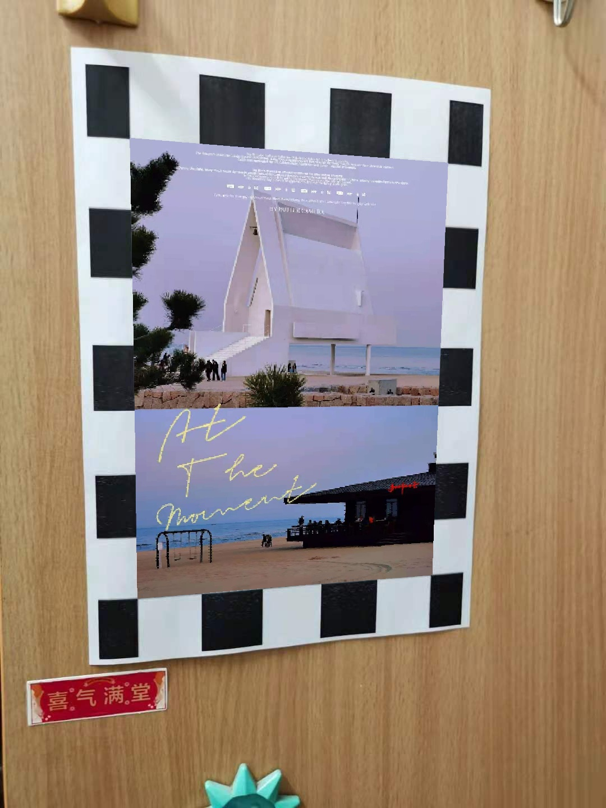

# Model Cablibartion

Code for Computaion Photography Course Homework, PKU 2021

- [part1.py](./part1.py) (model calibration with chessboard images)
- [part2-3.py](./part2-3.py) (model calibration with self-shot chessboard images and reprojection error analysis)
- [part4.py](./part4.py) (reality augementation)

I also discuss the use of [DeepCalib](https://github.com/alexvbogdan/DeepCalib) to estimate camera parameters. For more details, please see the [report](./Report.pdf).

A demo of reality augementation:

